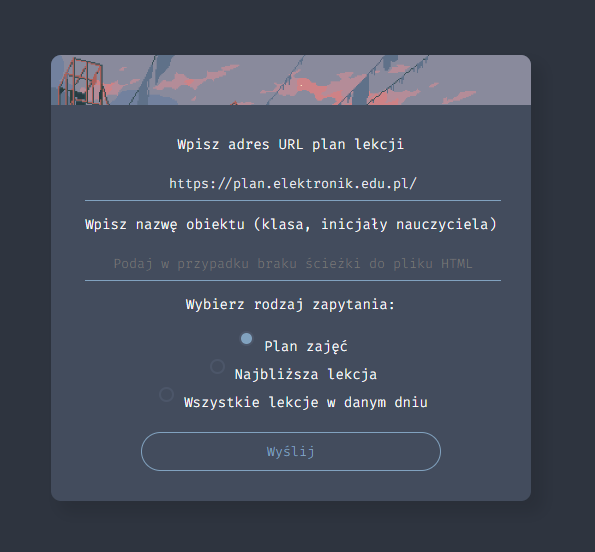

# 📅 Schedule Scrapper

Simple web scrapper that works with Vulkan's Optivum schedule.

**Check it out** 👉 [click me](https://schedulescrapper.herokuapp.com/)

## 📃 Features
- [x] scraping schedule
- [x] checking next lesson
- [x] checking all lessons at certain day
- [x] exporting results to JSON

## ⚙ GET parameters
To save preferences (as URL, name, querytype) you can bookmark whole URL with GET parameters. List of those parameters you can find below:
- **r** - type of response you want to get (html, json) - **values:** html, json
- **q** - query type (whole schedule, single lesson, all lessons at certain day) - **values:** schedule, currentLesson, everyLesson
- **t** - used when searching for next lesson - **24-hour time format** (military time) e.g. 7:00
- **d** - day index - from 0 to 6 where Sunday has index 0
    Sunday - 0, Monday - 1, Tuesday - 2, Wednesday - 3, Thurdsay - 4, Friday - 5, Saturday - 6
- **n** - name of object you are searching for (class, teacher's initials, classroom number)
- **m** - match whole word - **values:** true, false
- **a** - add minutes to given time (there is no GUI option for that)

### 📝 Example
    ?q=currentLesson&url=https://plan.elektronik.edu.pl/plany/o31.html&t=21:31&d=5&n=4I.&r=html&a=3
    
## 🎨 Custom CSS

        @-moz-document domain("schedulescrapper.herokuapp.com") {
            :root{
                --accent-color: #eba0ac;
                --background-color: #181825;
                --foreground-color: #1e1e2e;
                --light-background: #313244;
                --error-color: #f38ba8;
                --text-color: #efefef;
            }
        }
        
If you don't like Nord, you can use **Stylus extension** to change the color palette. The code above will change color scheme to **Catppuccin**, but you can obviously change it to your preference.

## 👤 Credits
Project was made by **Aleksander Jóźwik** (@jozwikaleksander).
